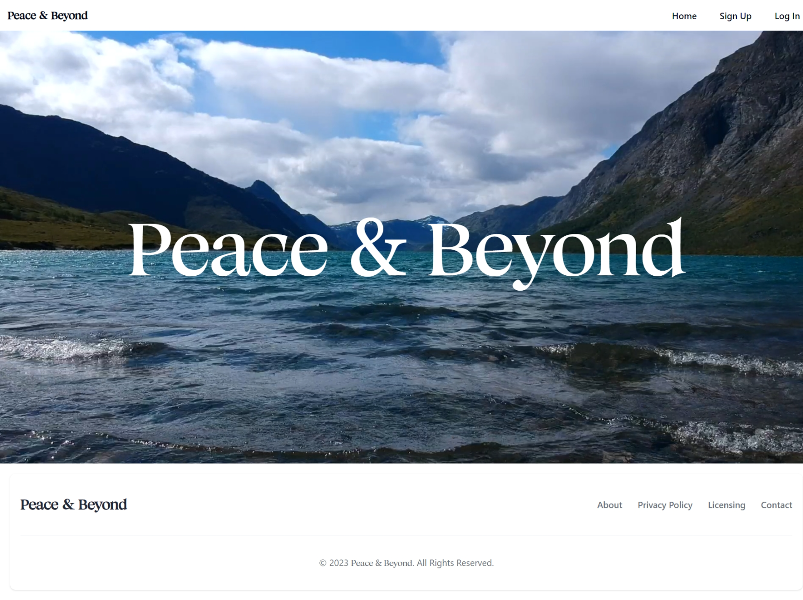

# PEACE & BEYOND

## Dynamic Travel Itinerary Planner

<h2>Introduction</h2>

Peace &amp; Beyond is a dynamic travel itinerary planner that not only helps users plan trips but also adjusts recommendations in real-time based on weather, traffic, and personal preferences. The system integrates AR features for immersive destination previews and leverages free plans of weather and traffic APIs such as Open Weather and Google Maps.

<a href="https://github.com/Holy-Morphism/Peace-Beyond">Travel &amp; Beyond Github Repository</a>

<h2>Setup Instructions</h2>

<ol>
<li><strong>Clone the repository</strong>: Clone the Peace &amp; Beyond repository to your local machine using the following command:</li>
</ol>

<pre><code>git clone https://github.com/Holy-Morphism/Peace-Beyond
</code></pre>

<ol start="2">
<li><strong>Install MongoDB</strong>: Peace &amp; Beyond uses MongoDB as its database. If you don't have MongoDB installed, you can download it from <a href="https://www.mongodb.com/try/download/community">here</a>.</li>
</ol>

<ol start="3">
<li><strong>Install dependencies and start the server:</strong></li>
</ol>

<pre><code>cd server
npm install
npm run dev
</code></pre>

This will install all necessary dependencies and start the server.

<ol start="4">
<li><strong>Install dependencies and start the client:</strong></li>
</ol>

<pre><code>cd client
npm install
npm start
</code></pre>

This will install all necessary dependencies and start the client.

Now, you should be able to access the application at <code>http://localhost:3000</code> (or whatever port you've configured).

<h2>Features</h2>

<h3>Admin Module</h3>

<ul>
<li><strong>User Management</strong>: Admins can create, update, and delete user accounts. User profiles include personal information, travel preferences, and saved itineraries.</li>
<li><strong>Itinerary Management</strong>: Admins can view and manage user-generated itineraries. They can approve or reject proposed itineraries and add custom recommendations.</li>
<li><strong>Content Management</strong>: Admins can update destination information, attractions, and points of interest. They can add new destinations and remove outdated content.</li>
<li><strong>Weather Integration</strong>: The system automatically fetches real-time weather forecasts for each destination from configured data sources. Weather conditions influence itinerary recommendations.</li>
<li><strong>Traffic and Transportation</strong>: The system integrates real-time traffic information from sources like Google Maps API. Traffic information affects route recommendations. Admins can set preferences for transportation modes.</li>
</ul>

<h3>User Module</h3>

<ul>
<li><strong>User Authentication</strong>: Users can create accounts and log in securely. Authentication ensures privacy and personalized experiences.</li>
<li><strong>Trip Planning</strong>: Users can input travel dates, destinations, and preferences. The system generates personalized itineraries based on user inputs. Users can modify itineraries as needed.</li>
<li><strong>Real-Time Recommendations</strong>: The system adjusts recommendations based on real-time factors like weather conditions and traffic congestion, as well as personal preferences.</li>
<li><strong>AR Features</strong>: Users can access AR-powered features like virtual tours of destinations and attractions, real-time information overlays, and potentially language translation capabilities for seamless communication.</li>
</ul>

<h2>Future Enhancements</h2>

The AR features and language translation capabilities are currently under consideration and may be added in future updates.

